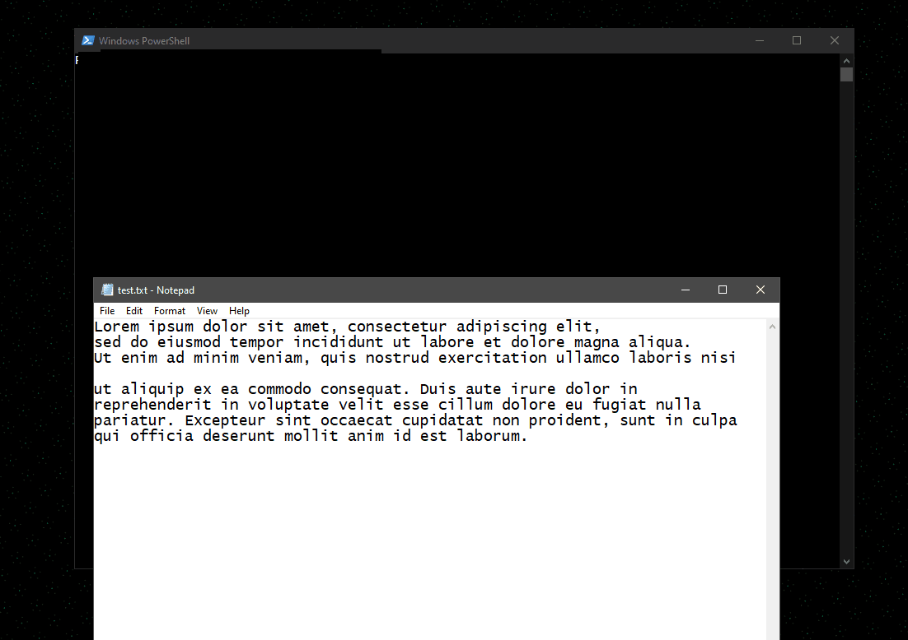

# Add Line Numbers | ALN | 1.0

This program takes input file and outputs the same file with line numbers.

## Features

- Add line numbers to your file 
- Remove line numbers from your file [not yet implemented]
- Remove unessecary \n and spaces [not yet implemented]
- Remove comments [not yet implemented]
- ...?
  
## Usage/Examples

To compile:
``` javac Main.java ```

To run:
``` java Main <file_name> ```

## Demo

<p align="center">
    </img>
</p>

## Author

- [@Banogrono](https://www.github.com/Banogrono)

  
